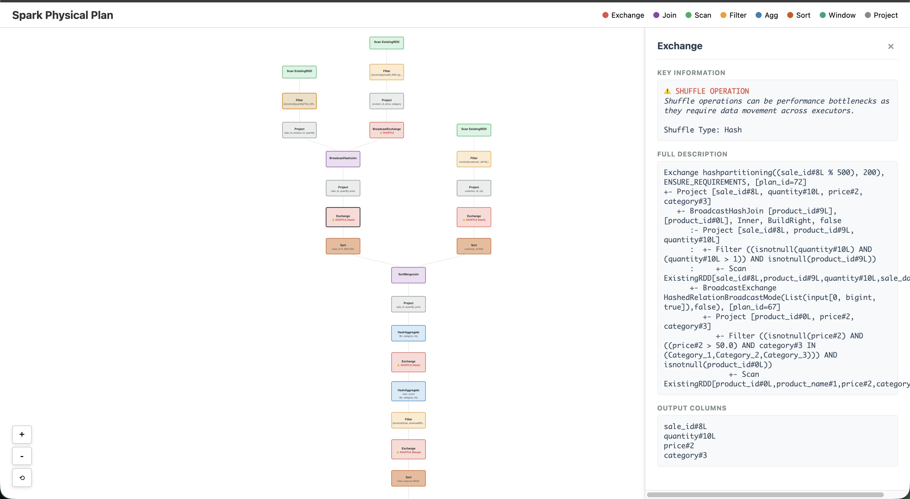

# Gallery

Complete, runnable examples showing every optimization rule in action.
Each section shows a **bad pattern** (triggers the rule) and a **fix**.

The same gallery lives as a Jupyter notebook at
[`notebooks/example.ipynb`](https://github.com/montanarograziano/spark_plan_viz/blob/main/notebooks/example.ipynb)
— open it after `uv sync --all-groups` for interactive `visualize_plan` output.

All examples assume this setup:

```python
from pyspark.sql import SparkSession
from pyspark.sql import functions as F
from pyspark.sql.window import Window
from spark_plan_viz import visualize_plan, analyze_plan, Severity

spark = SparkSession.builder.appName("examples").getOrCreate()

employees = spark.createDataFrame([
    (1, "Alice", 34, "Engineering", 95000),
    (2, "Bob",   45, "Sales",       85000),
    (3, "Cathy", 29, "Engineering", 78000),
    (4, "David", 38, "Marketing",   72000),
    (5, "Eve",   42, "Sales",       88000),
], ["id", "name", "age", "department", "salary"])

departments = spark.createDataFrame([
    ("Engineering", "Tech",     "US"),
    ("Sales",       "Business", "US"),
    ("Marketing",   "Business", "EU"),
], ["dept_name", "division", "region"])

orders = spark.createDataFrame([
    (1, 1, 100.0), (2, 2, 250.0), (3, 1, 75.0),
    (4, 3, 300.0), (5, 5, 180.0), (6, 4, 90.0),
], ["order_id", "emp_id", "amount"])
```

---

## Complex Join with Aggregation

A three-table join with filters and aggregation — the kind of query where `df.explain()` output becomes hard to read:

```python
result = (
    employees.filter(employees.age > 30)
    .join(orders, employees.id == orders.emp_id, "inner")
    .join(departments, employees.department == departments.dept_name, "left")
    .filter(orders.amount > 80)
    .groupBy("division")
    .agg({"salary": "avg", "age": "max"})
    .sort("division")
)

visualize_plan(result, notebook=True)
```



---

## Error: Cross Join

A cross join produces the Cartesian product — if both sides have 1 000 rows, the result has 1 000 000.

```python
# BAD — triggers cross_join rule (ERROR)
result = employees.crossJoin(departments)
visualize_plan(result)

# FIX — add a join condition
result = employees.join(departments, employees.department == departments.dept_name)
visualize_plan(result)
```

---

## Error: Nested Loop Join

A non-equality condition forces an O(n*m) nested loop join.

```python
# BAD — triggers nested_loop_join rule (ERROR)
result = employees.join(orders, employees.salary > orders.amount)
visualize_plan(result)

# FIX — add an equality predicate alongside the range condition
result = employees.join(
    orders,
    (employees.id == orders.emp_id) & (employees.salary > orders.amount),
)
visualize_plan(result)
```

---

## Warning: Expand (CUBE / multiple COUNT DISTINCT)

```python
# BAD — triggers expand rule (WARNING): each row is multiplied by grouping sets
result = employees.cube("department", "age").count()
visualize_plan(result)

# Also triggers expand — multiple COUNT DISTINCT
result = employees.groupBy("department").agg(
    F.countDistinct("id"),
    F.countDistinct("name"),
)
visualize_plan(result)
```

---

## Warning: explode() Row Explosion

```python
# BAD — triggers generate_explode rule (WARNING)
tagged = employees.withColumn("tags", F.array(F.lit("a"), F.lit("b")))
result = tagged.select("id", F.explode("tags").alias("tag"))
visualize_plan(result)

# BETTER — project narrow columns before explode
result = tagged.select("id", "tags").select("id", F.explode("tags").alias("tag"))
visualize_plan(result)
```

---

## Warning: No Partition Pruning

```python
import tempfile, os
with tempfile.TemporaryDirectory() as tmp:
    path = os.path.join(tmp, "emp_part")
    employees.write.mode("overwrite").partitionBy("department").parquet(path)

    # BAD — PartitionFilters: [] reads every partition
    result = spark.read.parquet(path)
    visualize_plan(result)

    # FIX — filter on the partition column
    result = spark.read.parquet(path).filter(F.col("department") == "Sales")
    visualize_plan(result)
```

---

## Warning: No Pushed Filters Detected

Reading a table without pushed filters wastes I/O.

```python
# BAD — triggers full_table_scan rule (WARNING)
result = spark.read.parquet("path/to/employees.parquet").select("id", "name")
visualize_plan(result)

# BETTER — add a filter; on Parquet/ORC it gets pushed to storage
result = spark.read.parquet("path/to/employees.parquet").filter(
    F.col("age") > 30
).select("id", "name")
visualize_plan(result)
```

---

## Warning: Expensive collect_list / collect_set

These aggregate all values into one executor's memory.

```python
# BAD — triggers expensive_collect rule (WARNING)
result = employees.groupBy("department").agg(
    F.collect_list("name").alias("all_names")
)
visualize_plan(result)

# GOOD — standard aggregates are safe
result = employees.groupBy("department").agg(
    F.avg("salary").alias("avg_salary"),
    F.count("*").alias("headcount"),
)
visualize_plan(result)
```

---

## Warning: Window Without PARTITION BY

A global window moves all data to one partition.

```python
# BAD — triggers window_without_partition rule (WARNING)
w = Window.orderBy("salary")
result = employees.withColumn("global_rank", F.row_number().over(w))
visualize_plan(result)

# FIX — add PARTITION BY to distribute the work
w = Window.partitionBy("department").orderBy("salary")
result = employees.withColumn("dept_rank", F.row_number().over(w))
visualize_plan(result)
```

---

## Warning: Python UDF

Python UDFs serialize data between JVM and Python on every row.

```python
# BAD — triggers python_udf rule (WARNING)
@F.udf("string")
def upper_name(s):
    return s.upper() if s else None

result = employees.select(upper_name("name").alias("upper_name"))
visualize_plan(result)

# FIX — use Spark's built-in upper()
result = employees.select(F.upper("name").alias("upper_name"))
visualize_plan(result)
```

---

## Warning: Redundant Shuffle

Back-to-back repartitions waste a full network shuffle.

```python
# BAD — triggers redundant_shuffle rule (WARNING)
# sortWithinPartitions keeps the first exchange from being elided
result = (
    employees.repartition(10, "department")
    .sortWithinPartitions("department")
    .repartition(5)
)
visualize_plan(result)

# FIX — single repartition
result = employees.repartition(10, "department")
visualize_plan(result)
```

---

## Warning: Sort Before Shuffle

A Sort immediately under an Exchange is wasted — the shuffle destroys order.

```python
# BAD — triggers sort_before_shuffle rule (WARNING)
result = employees.orderBy("salary").repartition(4)
visualize_plan(result)

# FIX — sort after the shuffle, or drop sort if order is not needed
result = employees.repartition(4).sortWithinPartitions("salary")
visualize_plan(result)
```

---

## Warning: Extreme Partition Counts

```python
# BAD — triggers partition_count_low (WARNING)
result = employees.repartition(1)
visualize_plan(result)

# BAD — triggers partition_count_high (WARNING)
result = employees.repartition(20_000)
visualize_plan(result)

# BETTER
result = employees.repartition(8)
visualize_plan(result)
```

---

## Info: Missing Broadcast Hint

Shuffle joins are expensive when one side is small.

```python
# BEFORE — supported shuffle join (triggers missing_broadcast_hint rule, INFO)
spark.conf.set("spark.sql.autoBroadcastJoinThreshold", "-1")
result = employees.join(departments, employees.department == departments.dept_name)
visualize_plan(result)

# FIX — explicit broadcast avoids the shuffle
result = employees.join(
    F.broadcast(departments), employees.department == departments.dept_name
)
visualize_plan(result)
```

---

## Warning: Row-Based Scan Without Pushdown (CSV / JSON)

Row-based formats without pushed filters often lead to expensive scans.

```python
# BAD — triggers non_columnar_no_pushdown rule (WARNING)
csv_df = spark.read.csv("path/to/data.csv", header=True)
visualize_plan(csv_df)

# FIX — convert to Parquet
csv_df.write.parquet("path/to/data.parquet")
pq_df = spark.read.parquet("path/to/data.parquet")
visualize_plan(pq_df)
```

---

## Info: Round-Robin Repartition

`repartition(n)` triggers a full shuffle even when reducing partitions.

```python
# BAD — triggers coalesce rule (INFO)
result = employees.repartition(2)
visualize_plan(result)

# FIX — coalesce avoids the full shuffle
result = employees.coalesce(2)
visualize_plan(result)
```

---

## Warning: Single-Partition Exchange

Global exchanges can serialize a stage onto one task.

```python
# Triggers single_partition_exchange rule (WARNING)
# (often together with window_without_partition)
from pyspark.sql.window import Window

window = Window.orderBy("id")
result = employees.withColumn("rn", F.row_number().over(window))
visualize_plan(result)
```

---

## Info: Potentially Unnecessary Sort

A Sort whose order is not consumed by SortMergeJoin / Window / TakeOrderedAndProject.
(Spark often removes pure `orderBy → aggregate` sorts; `dropDuplicates` still keeps the Sort.)

```python
# BAD — triggers unnecessary_sort rule (INFO)
result = employees.orderBy("salary").dropDuplicates(["department"])
visualize_plan(result)

# FIX — drop the unused orderBy
result = employees.dropDuplicates(["department"])
visualize_plan(result)
```

---

## Info: AQE Skew Join Active

`skew_join` is informational. It fires when Adaptive Query Execution has already
marked a join with `isSkew=true` on the **runtime / final** plan. Tiny local
DataFrames almost never produce that flag before an action runs on skewed keys.

**How to see it in a real job**

1. Enable AQE (`spark.sql.adaptive.enabled=true`, default since Spark 3.2).
2. Join a large fact table to a dimension with a few very hot keys.
3. Run an action, then inspect the **Final Plan** in the Spark UI SQL tab
   (or re-call `visualize_plan` / `analyze_plan` on the completed query).
4. Look for `SortMergeJoin …, true` / `isSkew=true` → `skew_join` (INFO).

**What the finding looks like**

```text
[info] skew_join  AQE Skew Join Active
  This join is marked as skew-optimized by Adaptive Query Execution...
```

If skew remains after AQE, salt hot keys or pre-aggregate the heavy side.

---

## New-rules combo (Expand + explode + partition miss)

Stack the Spark 3.5/4 refresh rules in one workflow:

```python
import tempfile, os

with tempfile.TemporaryDirectory() as tmp:
    path = os.path.join(tmp, "emp_part")
    employees.write.mode("overwrite").partitionBy("department").parquet(path)

    # 1) empty_partition_filters
    scanned = spark.read.parquet(path)
    visualize_plan(scanned)

    # 2) generate_explode
    exploded = (
        scanned.withColumn("tags", F.array(F.lit("x"), F.lit("y")))
        .select("id", "department", F.explode("tags").alias("tag"))
    )
    visualize_plan(exploded)

    # 3) expand (cube)
    cubed = exploded.cube("department", "tag").count()
    visualize_plan(cubed)
```

---

## Programmatic Analysis

Use `analyze_plan()` to get suggestions without rendering:

```python
from spark_plan_viz import analyze_plan, Severity

# Build a deliberately suboptimal query
result = (
    employees.crossJoin(departments)
    .groupBy("division")
    .agg(F.collect_list("name").alias("all_names"))
)

suggestions = analyze_plan(result)
for s in suggestions:
    print(f"[{s.severity.value:7s}] {s.title}")
    print(f"         {s.message}\n")

# Filter by severity
errors = [s for s in suggestions if s.severity == Severity.ERROR]
print(f"{len(errors)} error(s), {len(suggestions)} total finding(s)")
```
